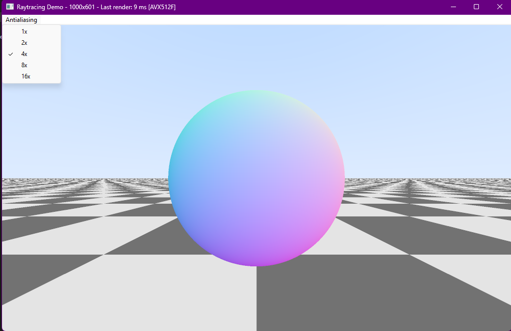

# win32-raytrace-cpu

This single file program is a real-time ray tracing demo written in C++ for Windows. It creates a window using the Win32 API and renders a simple 3D scene (a sphere, a ground plane, a gradient sky). 
Used to demonstrate a simple way to handle hardware dependent multithreading and SIMD acceleration of an _'embarrassingly'_ parallel algorithm like ray tracing.

## features include:
- **Antialiasing:** Supports configurable supersampling (1x, 2x, 4x, 8x, 16x) via a menu, improving image quality by averaging multiple samples per pixel.
- **Multithreading:** Splits rendering work across multiple CPU threads for faster performance.
- **SIMD Acceleration:** Uses SSE2 or (if available) AVX512 SIMD instructions to speed up pixel calculations.
- **Basic Performance Info:** Updates the window title with the current resolution, render time, and which SIMD architecture was used.

